# 💫 About Me:

- 🎓 Técnico Superior en Desarrollo de Aplicaciones Web
- 🔎 Buscando oportunidades como Junior Data Analyst / BI Analyst
- 📊 Experiencia con Power BI, SQL, ETL y análisis de datos
- 🏆 Desarrollando proyectos personales de Data Analytics y Business Intelligence
- ⚡ *Fun fact:* No me gusta hacer `DROP DATABASE`

# 🌐 Socials:

# 💻 Tech Stack:
             

# 📊 GitHub Stats:

  
  

### ✍️ Random Dev Quote
<picture>
  <source media="(prefers-color-scheme: dark)" srcset="https://quotes-github-readme.vercel.app/api?type=horizontal&theme=github_dark&border=true" />
  <source media="(prefers-color-scheme: light)" srcset="https://quotes-github-readme.vercel.app/api?type=horizontal&theme=github&border=true" />
  
</picture>

---

<!-- Proudly created with GPRM ( https://gprm.itsvg.in ) -->
<picture>
  <source media="(prefers-color-scheme: dark)" srcset="https://raw.githubusercontent.com/JohanStragus/JohanStragus/output/github-snake-dark.svg" />
  <source media="(prefers-color-scheme: light)" srcset="https://raw.githubusercontent.com/JohanStragus/JohanStragus/output/github-snake.svg" />
  
</picture>
